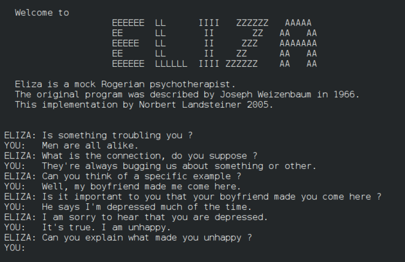

# Introduction to Artificial Intelligence (AI) {.unnumbered}

## Brief history and evolution of AI {.unnumbered}

### The Computer {.unnumbered}

Computers have existed for hundreds of years , with one of the earliest inventions being the abacus which it's thought to have been invented around the 2<sup>nd</sup> century BC.

```{r, echo=FALSE,out.width="100%",fig.cap="Chinese abacus-suanpan https://enthu.com/blog/abacus/who-invented-the-abacus/",out.height="20%",fig.show='hold'}
knitr::include_graphics("images/abacus.jpg")
```

The first computers were mechanical computers. This computers were designed to solve complex number intensive problems. Later, it evolved to computers with electronic components. Below a brief timeline on computers[@computer]:

-   **1801:** Weaving machine using wooden cards to craft designs automatically onto fabrics
-   **1821:** Charles Babbage builds the "difference engine" which is a steam-driven calculator
-   **1848:** Ada Lovelace, writes first computer program.
-   **1853:** First printing calculator
-   **1890:** Punch card system to calculate 1890 U.S Census
-   **1931:** Differential Analyer- General purpose mechanical analog computer
-   **1936: ** Alan Turing, a British scientist and mathematician, introduce the principle of a universal machine, "The Turing Machine" [@turing1936computable].
-   **1937: ** John Vincent, proposes to build a first electric-only computer at Iowa State University.
-   **1941:** Konrad Zuse completes the Z3, the world's first electromechanical, programmable computer, in Germany.

-   **1945:** The Electronic Numerical Integrator and Computer (ENIAC), the first general-purpose electronic computer, becomes operational in the United States, marking a pivotal moment in computing history.

-   **1951:** UNIVAC I, the first commercially produced computer, is delivered to the U.S. Census Bureau, demonstrating the potential for computing in data processing.

-   **1969:** ARPANET, the precursor to the internet, is established, connecting four U.S. universities and heralding the digital age.[@arpanet]

-   **1971:** Intel releases the first commercially available microprocessor, the 4004, a milestone in the development of personal computers. [@Intel]

-   **1983:** The introduction of the IBM PC XT and the Apple Lisa popularizes personal computing, paving the way for desktop computing's widespread adoption.

-   **1991:** Tim Berners-Lee creates the World Wide Web, revolutionizing communication and information sharing on a global scale.

-   **2007:** Apple releases the iPhone, ushering in the era of smartphones and mobile computing.

-   **2011:** IBM's Watson defeats human champions in Jeopardy!, showcasing the potential of artificial intelligence.

-   **2019:** Quantum supremacy is achieved as Google's quantum computer performs a task faster than traditional supercomputers, signaling a new frontier in computing.
### Birth of AI- 1950 {.unnumbered}

During this time, Alan Turing proposed that machines should be able to use information and reasoning to solve problems and make decisions.On his paper, "Computing Machinery and Intelligence"[@AI_timeline], Turing discusses how to build this artificial intelligence machines.

However, at the time, machines were only able to execute commands but did not have the ability to store them for later use. Additionally, using a computer could cost up to $200,000 per month. Thus, there was a need to show investors why AI was worth pursuing

### Proof of Concept - The Logic Theorist {-}

The Logic Theorist, often referred to as the "LT," was one of the earliest computer programs designed to simulate human problem-solving and mathematical reasoning. Developed by Allen Newell and Herbert A. Simon in 1955, the Logic Theorist was a pioneering artificial intelligence (AI) program.

The "LT" was presented at Dartmouth Summer Research Project on Artificial Intelligence (DSRPAI)[@dartmouth] in 1956. Although the conference did not fulfill all expectations, many top researchers in various fields agreed upon the idea that artificial intelligence was achievable.
[@R-bookdown]

### AI blooming - 1956- 1974 {-}

Programs developed during these years were staggering. Computers were being able to solve algebra word problems, proving theorems and even learning to speak. Many believed that fully intelligent machines would be built in less than 20 years which cause DARPA to fund these efforts as well.

#### General Problem Solver: ELIZA [@ELIZA] {-}
-   Created at MIT by Joseph Weizenbaum
-   Simulated conversation using pattern matching
-   Gave an illusion of understanding but lacked real comprehension
-   Used separate "scripts" for language capabilities
-   Notable script: DOCTOR, emulated psychotherapist
-   Responded with non-directional questions
-   One of the first chatterbots and Turing test attempts.
-   Weizenbaum created ELIZA to explore human-machine communication.
-   People attributed human feelings to ELIZA, surprising Weizenbaum.
-   Hopes that ELIZA could help individuals with psychological issues and aid doctors.
-   Despite its limitations, some believed ELIZA was intelligent and understanding.
-   Original ELIZA source-code was missing for decades.
-   Recently discovered in MIT archives and published online.
-   Source-code showcases historical programming techniques and software layering.

```{r, echo=FALSE,out.width="100%",fig.cap="Conversation with ELIZA https://en.wikipedia.org/wiki/ELIZA",out.height="20%",fig.show='hold'}

```

#### ELIZA on MacOS {-}

If nowadays you want to run the ELIZA AI, you can do so on MacOS. It comes as an Easter egg on emacs.

**Step-by-Step Instructions**
- Step 1: Open Terminal. Terminal can be found in the Applications folder in Finder, in Launchpad, or by searching in Spotlight.

- Step 2: Type ‘emacs’ followed by the return key.

- Step 3: Press the return key again.

- Step 4: Press the Esc and X keys at the same time.

- Step 5: Type ‘doctor’ followed by the return key.

To exit , you can simply click on the x. 

### The AI Winter - 1974- 1980 and 1987-1993 {-}

AI faced a series of setbacks known as "AI winters" due to overhyped expectations and unmet promises. Funding and interest in AI waned during these periods.[@aiwinter]

-   1966: Machine translation failure
-   1969: Perceptrons criticism
-   1971–75: DARPA's Speech program frustration
-   1973: UK AI research decline
-   1973–74: DARPA cuts AI funding
-   1987: LISP machine market collapse
-   1988: Strategic Computing funding canceled
-   1990s: Abandoned expert systems
-   1990s: Fifth Generation project shift

### Resurgence of AI {-}

AI experienced a revival in the 1980-1987 thanks to advancements in machine learning, deep learning, and the availability of large datasets.
During this time, "expert systems" -a form of AI- was adopted by companies worldwide.

We have not improved much on how AI is made, however, the physical limits were holding us back. We were reaching to the limit of the memory and speed our computers were capable of having. Moore's Law states that the number of transistors ona microchip doubles every two years. This also means our storage and speed increases every two years and for AI, this was extremely slow. 

Breakthroughs like IBM's Deep Blue defeating a world chess champion in 1997 and Google's AlphaGo defeating a Go world champion in 2016 brought AI into the limelight.

**AlphaGO**
```{r, echo=FALSE,out.width="100%",fig.cap="AlphaGo vs. Go Champion https://www.popularmechanics.com/technology/a19844/googles-alphago-ai-wins-first-round-against-go-champion/",fig.show='hold'}
knitr::include_graphics("images/alphago.png")
```
**IBM's Deep Blue**
```{r, echo=FALSE,out.width="100%",fig.cap="One of the two towers of Deep Blue https://americanhistory.si.edu/collections/search/object/nmah_1005331",fig.show='hold'}
knitr::include_graphics("images/deepblue.jpg")
```
#### Expert systems {-}

An expert system is a program that answers and/or solves specific problems using logical rules derived from the field experts that these problems belong to.

Some examples of expert systems are: 

-   MYCIN: Developed for medical diagnosis, MYCIN could recommend antibiotics for bacterial infections based on patient symptoms and lab test results.

-   Dendral: One of the earliest expert systems, Dendral was designed for chemical analysis and could infer the molecular structure of organic compounds.

-   XCON: Developed by IBM, XCON was used for configuring computer systems, allowing users to customize hardware and software configurations.

-   PROSPECTOR: An expert system used in mineral exploration, PROSPECTOR helped geologists identify potential areas for mineral deposits.

-   CLIPS: The C Language Integrated Production System (CLIPS) is a popular open-source expert system development tool used for various applications, including rule-based reasoning.

-   R1/XCON: A variant of XCON, R1 was used in the airline industry for scheduling and flight planning, allowing for efficient allocation of resources.

-   D3: Developed for the interpretation of oil well drilling data, D3 helped engineers make decisions about drilling operations.

-   CADIAG-IV: Focused on medical diagnosis, CADIAG-IV assisted in identifying diseases and suggesting treatment options based on patient data.

-   Mycin-like: Similar to MYCIN, this expert system was created for diagnosing bacterial infections and recommending antibiotics.

-   Cyc: An ambitious project, Cyc aims to represent human knowledge in a formal, machine-readable format, facilitating reasoning and problem-solving.


## Types of AI: Narrow AI vs. General AI {.unnumbered}

### Narrow AI (Weak AI) {-}

Narrow AI systems are designed for specific tasks and excel in those domains. They can perform tasks like natural language processing, image recognition, and recommendation systems. Examples include virtual assistants like Siri and Alexa.

### General AI (Strong AI) {-}

General AI represents machines with human-like cognitive abilities. These AI systems would possess the capacity to understand, learn, and perform any intellectual task that a human can do. General AI remains a theoretical concept and is yet to be realized.

## AI applications in various industries {.unnumbered}

**Healthcare:** AI is transforming healthcare with applications in medical image analysis, drug discovery, and personalized medicine. Machine learning models can assist in diagnosing diseases, and AI-powered robots can aid in surgeries.

**Finance:** In the financial sector, AI is used for fraud detection, algorithmic trading, and risk assessment. Chatbots and virtual assistants help improve customer service.

**Education:** AI is enhancing education through personalized learning platforms, intelligent tutoring systems, and automated grading. It adapts to individual student needs and provides valuable insights to educators.

**Autonomous Vehicles:** Self-driving cars use AI for navigation, obstacle detection, and decision-making. They have the potential to revolutionize transportation.

**Natural Language Processing (NLP):** NLP technologies power chatbots, language translation, and sentiment analysis. They enable human-like interaction with machines.

**Retail:** AI-driven recommendation engines enhance the customer shopping experience, and inventory management systems optimize supply chains.
