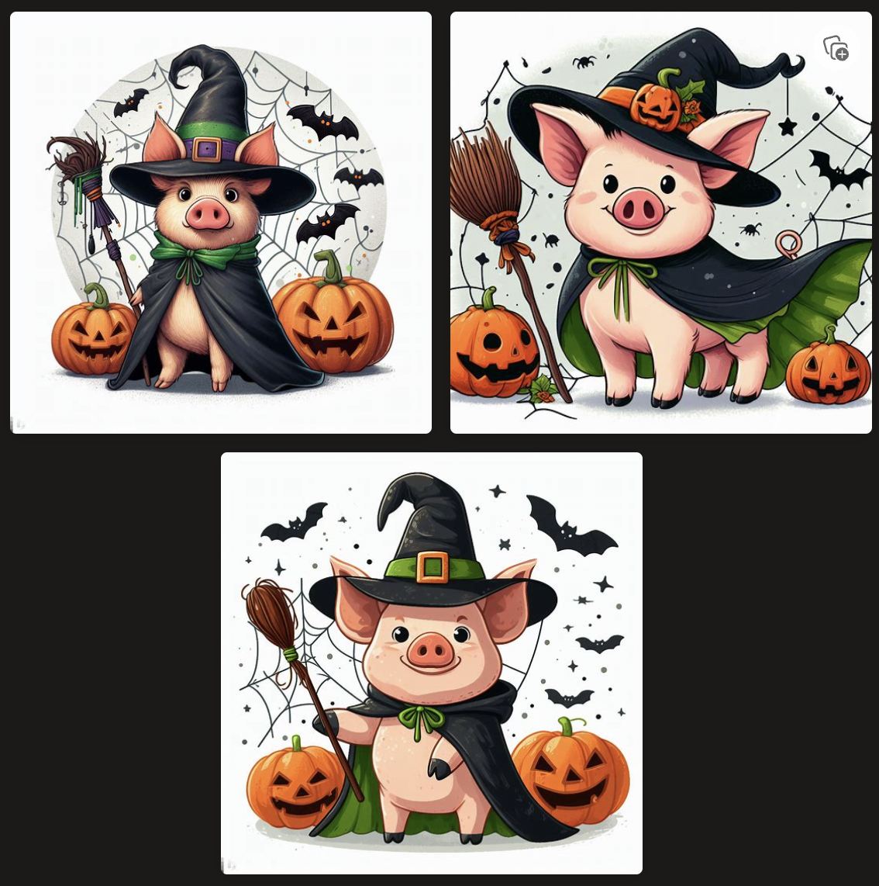

# Q&A and Wrap-up {-}

## Open discussion for participants to ask questions and share insights {-}

**How do open source and free AI make money ?**
Open sourcing a tool will bring the community together and help develop it further to then be able to use it on their company on paid services like ads or recommendations. To expand more , here are some ways they make money :

**Support and Services:** Offering paid support, consulting, and professional services for businesses that use the open source AI technology. This can include installation, customization, troubleshooting, and ongoing maintenance.

**Dual Licensing:** Some open source projects are released under a dual license model. One license is open source and free for community use, while the other is a commercial license that offers additional features, support, or rights that are attractive to enterprise users.

**SaaS (Software as a Service):** Creating a cloud-based version of the AI tool that is hosted and managed by the organization, which users can access via a subscription model. While the software itself is free to download and use, the cloud service (with its benefits of scalability, management, and sometimes advanced features) is not.

**Donations and Crowdfunding:** Soliciting donations from individuals and organizations that want to support the project. Platforms like GitHub Sponsors, Patreon, or Open Collective facilitate recurring contributions to projects and creators.

**Grants and Funding:** Obtaining financial support from governmental or non-governmental organizations that wish to promote technological development and innovation. This can be particularly prevalent in research-focused AI projects.

**Partnerships:** Entering into partnerships with other companies that can benefit from the AI project. This might involve collaborative development efforts where the partner funds certain aspects of the project.

**Training and Certification:** Providing training programs, workshops, and certification courses for individuals and corporations to effectively use the open source AI tools. These educational services can be a substantial revenue stream.

**Custom Development:** Building custom solutions for clients using the open-source AI as a foundation. This allows organizations to meet specific customer needs while promoting and improving their open-source project.

**Merchandising:** Selling branded merchandise can be a minor but additional revenue stream for popular open source projects.

**Freemium Features:** Offering the core product for free while charging for additional features, functionality, or plugins that enhance the basic version of the software.

**Indirect Monetization:** Sometimes, a company will open source a tool purely for the goodwill and community engagement it brings, which can enhance the company's reputation and indirectly lead to increased sales of their other products or services.

## Recap of key takeaways from the workshop {-}

### Historical Context and AI Evolution {-}

**Understanding AI’s roots:** Appreciating the historical milestones from the inception of the term "artificial intelligence" in 1956 to the present helps contextualize today’s advancements.

**Progression of capabilities:** Demonstrating how AI has evolved from simple rule-based systems to complex neural networks that can understand and generate human language.

### Deep Dive into AI Models {-}

**Contrasting AI systems:** Discussing the differences and similarities between models like ChatGPT, Bard, and LLAMA-v2 can illuminate the varied approaches in natural language processing.

**Specific capabilities and uses:** Highlighting how each model is designed for different purposes, such as Bard for literature references or ChatGPT for coding assistance.

###  Ethics and Challenges of AI {-}

**Navigating ethical implications:** Delving into the importance of ethical AI development, including issues of bias, fairness, and the importance of transparency.

**Addressing challenges:** Discussing the ongoing challenges in AI, such as ensuring privacy, security, and the potential for misuse, and how the industry is addressing these issues.

### Practical Demonstrations and Use Cases {-}
**AI for problem-solving:** Showing how ChatGPT can assist in answering complex questions, such as interpreting and solving a probability question from an image, demonstrates practical problem-solving applications.

**Coding with AI:** The creation of a Python script for password brute-forcing with ChatGPT's help illustrates AI's potential as a programming assistant.

**Interdisciplinary applications:** Using DALL-E 3 in conjunction with Microsoft Bing chat to generate images such as a "Halloween pig" or a QR code of a bear showcases AI's creative capabilities.

<center>
```{r, echo=FALSE,fig.cap="Generated by Dalle-3",fig.show='hold'}

``` 
</center>


### Key Takeaways {-}

**AI as a multifaceted tool:** Emphasize how AI is not a one-size-fits-all solution, but a diverse range of tools each designed for specific tasks and challenges.

**The importance of responsible use:** Stress the importance of using AI responsibly, with an understanding of its limitations and the ethical considerations involved.

**Empowerment through AI:** Highlight how different AI tools can empower users to perform a variety of tasks more efficiently, from academic research to creative design.

**AI literacy:** The workshop itself serves as an example of the importance of AI literacy, equipping participants with knowledge to navigate and utilize AI technologies effectively.

