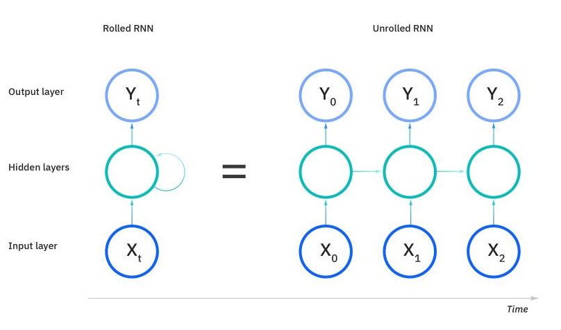
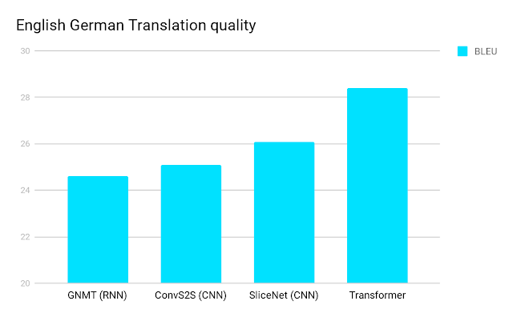
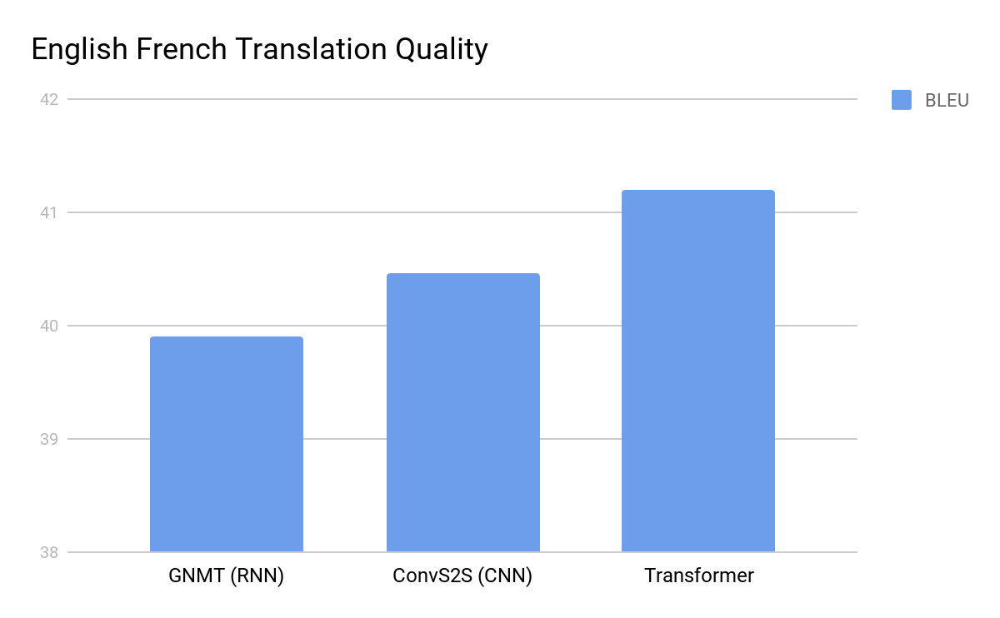

# Understanding Large Language Models {-}

Large Language Models (LLMs) represent a pivotal development in the field of artificial intelligence. These models, often referred to as LLMs, are transforming the way we process and generate human language. In this section, we will delve into the core aspects of these models, providing a comprehensive understanding of what they are, how they function, and what makes GPT (Generative Pre-trained Transformer) models stand out.

## What are large language models? {-}

Large Language Models are a category of artificial intelligence models designed to process and generate human language. They are characterized by their massive size, which encompasses millions or even billions of parameters, enabling them to capture intricate patterns, contexts, and nuances within textual data. LLMs are trained on vast corpora of text from the internet, allowing them to develop a broad and diverse understanding of language.

These models are versatile and can be fine-tuned for various natural language processing (NLP) tasks, such as text classification, language translation, text summarization, and even creative text generation. They have found applications across industries, including healthcare, finance, customer support, and content generation.

### So, How do they work? {-}
There are different types of neural networks, some very well known are : Recurrent Neural Networks (RNN) – Long-Short Term memory (LSTM), Convolutional Neural Networks (CNN) and they have been used as the backbone of LLMs. Google translate used to use LSTM on its engine until they developed the transformer architecture which improved their machine translation.

Sequential processing is a cornerstone of many neural network architectures designed to handle data where the order and context are important. In sequential processing, an input is processed one element at a time, with the sequence order preserved. This is particularly important in tasks like natural language processing, where the meaning of a sentence can be highly dependent on word order.

**Past Information and Hidden States**

In the context of sequential data, retaining information from previous inputs is crucial. Recurrent Neural Networks (RNNs), and more specifically Long Short-Term Memory (LSTM) networks or Gated Recurrent Units (GRUs), are designed to remember past information through their hidden states. Each hidden state contains information about the previous elements of the sequence, which influences the processing of the current and future elements. This allows the network to make decisions based on both the current input and what it has "seen" previously.

(\#fig:unnamed-chunk-1)unrolled RNN

As seen on the image above, an unrolled RNN would take the amount of time as the number of inputs. 

**Convolutional Neural Networks (CNNs)**

While CNNs are predominantly known for their application in image processing, they have also been adapted for sequential data such as text. When applied to text, CNNs can be implemented as multichannel networks, where each channel might use a different size of kernels, or filters, to capture various features from the input data. For instance, in text processing, small kernels can capture local information (like n-grams), while larger kernels can capture more global, contextual information.

Using multiple kernel sizes allows the model to learn representations of the data at different granularities. In natural language processing, this could mean capturing both the meaning of individual words and the broader semantics of phrases or sentences.

**CNNs and Larger Texts**

However, CNNs face challenges when dealing with very large texts. As the size of the input grows, the number of kernels—and consequently the computational resources and processing time required—increases significantly. This scaling issue makes CNNs less feasible for tasks involving large texts. The sheer number of parameters that would need to be learned and stored becomes unmanageable for long sequences.

In "Attention Is All You Need" paper introduces the Transformer, a neural network that excels in language understanding by utilizing a self-attention mechanism, outperforming traditional recurrent and convolutional models. It is more efficient, requiring fewer computational steps and less training time, and works well with parallel-processing hardware. The Transformer's attention mechanism allows for immediate context comprehension, improving tasks like translation and coreference resolution. Its effectiveness is also evident in tasks like syntactic constituency parsing. The open-sourced Tensor2Tensor library enables easy experimentation with the Transformer model, promising applications beyond language to include images and videos.

We can see the improvement in language translation in the following graphs.

(\#fig:unnamed-chunk-2)English to German Translation https://blog.research.google/2017/08/transformer-novel-neural-network.html

(\#fig:unnamed-chunk-3)English to French Translation https://blog.research.google/2017/08/transformer-novel-neural-network.html

## How do they work? (Transformer architecture)  {-}

[@NVIDIA]

At the heart of Large Language Models lies the Transformer architecture, a groundbreaking innovation in deep learning. The Transformer architecture revolutionized NLP by introducing the concept of self-attention mechanisms. Unlike previous sequential models, Transformers can consider and weigh the importance of every word in a sentence simultaneously, allowing them to capture long-range dependencies and relationships within the text.

Transformers consist of an encoder-decoder structure. In the context of LLMs, the encoder processes the input text, breaking it down into a series of embeddings that represent each word's meaning and context. The self-attention mechanism plays a crucial role here, as it determines how much focus should be given to each word when generating embeddings. Once the input text is encoded, the decoder generates the output, whether it's translating text, summarizing it, or generating a continuation.

## GPT (Generative Pre-trained Transformer) models overview {-}

Among the various Large Language Models, GPT (Generative Pre-trained Transformer) models have gained significant prominence. Developed by OpenAI, the GPT series includes models like GPT-2 and GPT-3, each progressively more substantial and capable than its predecessor. These models are pre-trained on massive datasets and can perform a wide range of language-related tasks with impressive fluency.[@GPT]

GPT models employ a unidirectional transformer architecture, making them adept at autoregressive text generation. They predict the next word in a sentence based on the preceding context, producing coherent and contextually relevant text. GPT models have been applied to tasks such as text completion, language translation, content generation, and even creative writing.

Understanding the foundations of Large Language Models, their underlying Transformer architecture, and the specific capabilities of GPT models is essential in comprehending their impact on various industries and their potential for reshaping the landscape of natural language processing.
