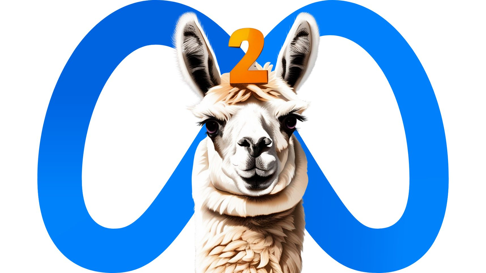

# Exploring to LLaMA-v2 {-}
 

LLaMa-v2, the Large Language Model Architecture version 2, represents a cutting-edge development in the realm of large language models. In this section, we will delve into the introduction, capabilities, and real-world applications of LLaMa-v2, shedding light on its significance in the field of artificial intelligence. [@llama]

## Introduction to LLaMA-v2 and its capabilities {-}

LLaMa-v2, as the name suggests, is the second iteration of the Large Language Model Architecture. It builds upon the successes and advancements of its predecessor, LLaMa, to offer enhanced capabilities and versatility in processing and generating natural language.

At its core, LLaMa-v2 leverages the Transformer architecture, a transformative innovation in deep learning that enables it to comprehend and generate human language with remarkable precision. With an extensive parameter count, often numbering in the billions, LLaMa-v2 possesses an unparalleled ability to capture intricate patterns, contexts, and nuances within textual data.

One of the defining features of LLaMa-v2 is its adaptability. It can be fine-tuned for a wide array of natural language processing tasks, including text classification, sentiment analysis, text summarization, language translation, and more. Its applications span across industries and domains, making it a versatile and powerful tool in the world of AI.

LLaMa-v2's capabilities extend beyond mere text generation. It can perform tasks such as natural language understanding, question-answering, content recommendation, and even creative content generation. Whether it's assisting in data analysis, automating customer support, or aiding in content creation, LLaMa-v2 proves to be a valuable asset in various applications.

## Use cases of LLaMA-v2 in real-world scenarios {-}

(The use cases are very similar to ChatGPT)

The versatility and proficiency of LLaMa-v2 make it an invaluable resource in real-world scenarios across multiple industries. Some of the notable applications include:

-Healthcare: LLaMa-v2 can assist medical professionals by summarizing patient records, generating reports, and providing quick access to medical information, contributing to more efficient healthcare delivery.

-Financial Services: In the finance sector, it aids in fraud detection, risk assessment, and customer service by analyzing vast volumes of financial data and providing insights in real-time.

-E-commerce: LLaMa-v2 enhances the customer shopping experience through personalized product recommendations, chatbots for customer inquiries, and content generation for e-commerce platforms.

-Education: It serves as a virtual tutor, helping students with explanations, answering questions, and providing study materials in a conversational manner, augmenting the learning process.

-Content Creation: Content creators benefit from LLaMa-v2's ability to suggest ideas, provide writing assistance, and even generate portions of text, streamlining content generation efforts.

-Research and Data Analysis: LLaMa-v2 aids researchers and data analysts by summarizing research papers, extracting insights from data, and generating reports, facilitating data-driven decision-making.

-Entertainment and Gaming: It can generate creative narratives, dialogues, and content for interactive games, entertainment, and storytelling applications, enhancing user engagement.

## Advantages of LLaMa-v2 {-}

-   Specialization: LLaMa-v2 can be fine-tuned for specific tasks and domains, making it well-suited for applications where domain expertise is crucial. It can be customized to excel in areas like healthcare, finance, legal, or any specialized field, providing more accurate and context-aware responses.

-   Task-Specific Performance: When fine-tuned appropriately, LLaMa-v2 can outperform ChatGPT in task-specific performance. It can be optimized for tasks such as medical diagnosis, legal document analysis, or financial data interpretation, delivering more precise results.

-   Data Privacy: LLaMa-v2 can be deployed on private servers, allowing organizations to maintain control over sensitive data. This can be crucial in industries like healthcare and finance, where data privacy and security are paramount.

-   Compliance: In industries with strict regulatory requirements, such as healthcare (HIPAA) or finance (GDPR), LLaMa-v2's customization capabilities make it easier to ensure compliance with data protection regulations.

-   Efficiency: Since LLaMa-v2 can be tailored to specific tasks, it may require fewer computational resources to achieve similar or better results compared to ChatGPT, which is a more general-purpose model. This can lead to cost savings in terms of hardware and infrastructure.

-   Reduced Noise: In certain applications, ChatGPT may generate more diverse and creative responses, which can be advantageous. However, it can also produce noise or off-topic content. LLaMa-v2's specialization can help reduce such noise by generating more focused responses.

-   Industry-Specific Knowledge: LLaMa-v2 can be pre-trained on industry-specific data and knowledge sources, enabling it to provide more accurate and relevant information in specialized domains.

-   Business Integration: LLaMa-v2's customization can facilitate seamless integration with existing business processes and workflows. It can be embedded into specific applications or systems to enhance their functionality.

-   Consistency: LLaMa-v2's specialization allows for greater control over the style, tone, and consistency of responses. This can be essential in maintaining a brand's voice or adhering to industry standards.

-   Multi-Modal Capabilities: Depending on the implementation, LLaMa-v2 may support multi-modal inputs and outputs, allowing it to process not only text but also images, audio, and other data types, expanding its utility.
