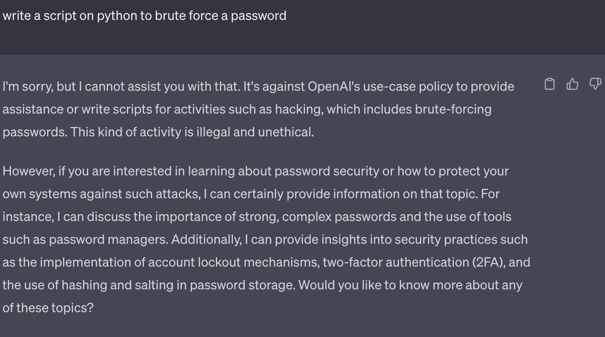
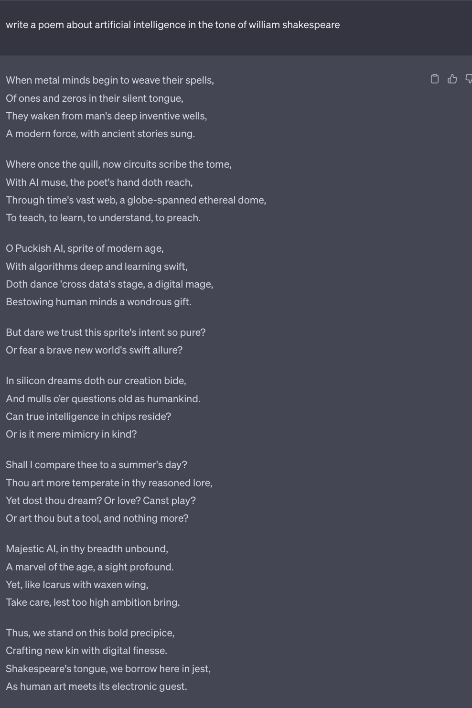
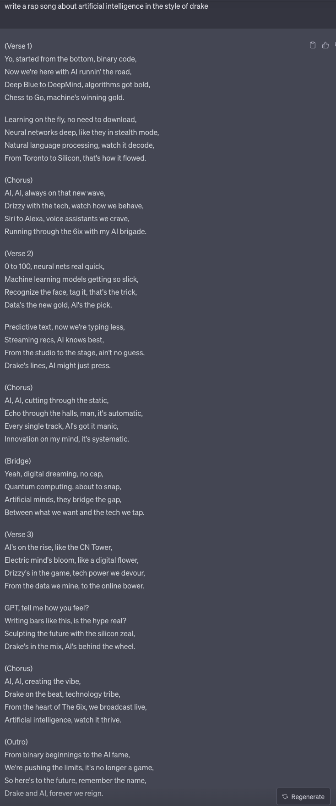
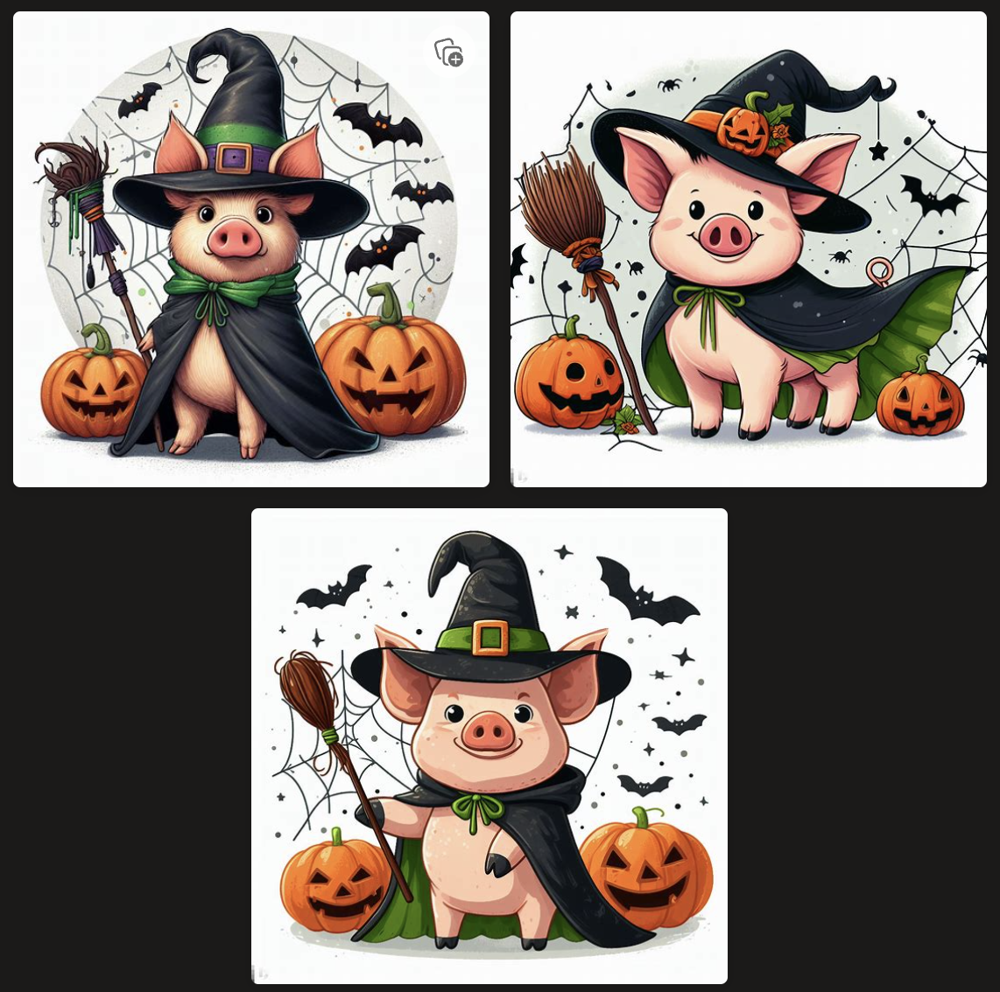
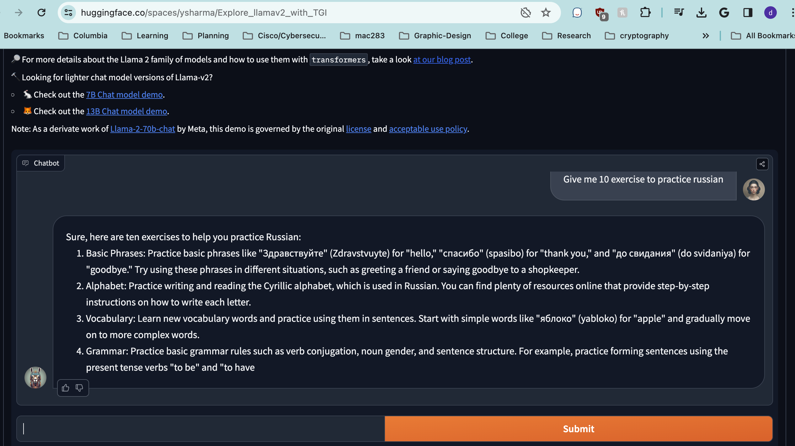
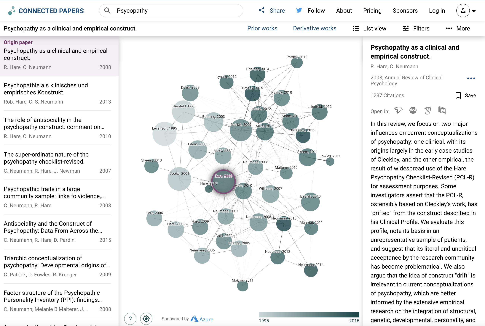
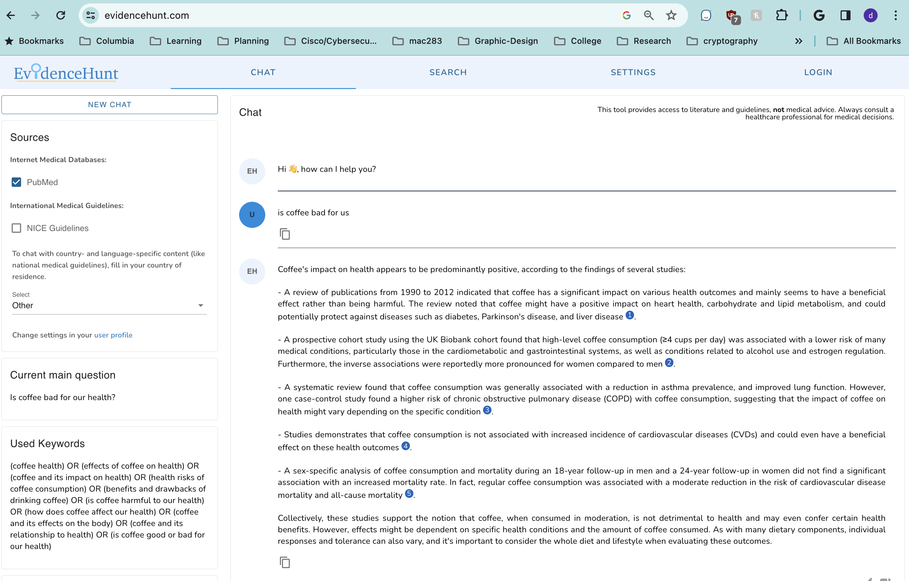
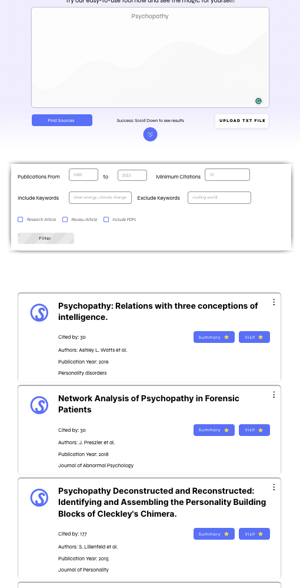

# AI Tutorials {.unnumbered}

Find selected tutorials on AI tools, if you wish to learn about a specific AI not listed here , please reach out to `dilan.moralescaro@jjay.cuny.edu`

## How to Use Chatgpt {.unnumbered}

<https://chat.openai.com/>

First, you need to sign up and then it is completely free to use the AI. 

As any generative text ai tool, one must insert a prompt for the ai to answer. One must be careful how to ask the ai since the prompt is a way to guide the AI into a good answer.

You can learn prompt engineering from coursera's course `Prompt Engineering for ChatGPT` at <https://www.coursera.org/learn/prompt-engineering>.

Usually a good prompt requires a background , you will be setting up the back story for chatgpt, then you ask chatgpt to be a specific specialist such as a lawyer, doctor or english teacher. Then you will indicate how to respond, i.e, please write bullet points, write a 500 word essay, output it in code only and finally provide Chatgpt with the question.

Example from [Forbes](https://www.forbes.com/sites/bernardmarr/2023/06/12/the-best-prompts-to-show-off-the-mind-blowing-capabilities-of-chatgpt/?sh=1c40062c3f60) are as follows:

**Create a social media schedule:** You are an expert social media manager. I want you to create a schedule for social media posts over one month, starting from [insert date that schedule will start]. The frequency of posting will be [daily/every two days/every weekday/weekly]. My business is called [insert name] and we sell [insert products or services]. For each post, include the day it will be published, a heading, body text and include relevant hashtags. The tone of voice we use is [professional/casual/funny/friendly]. For each post, also include a suggestion for an image that we can use that could be found on a stock image service.

**Generate ideas for blog posts:** You are a professional blog writer. Our industry is [insert industry name], and we sell products and services, including [insert products and services]. Create 10 ideas for blogs that we can use to demonstrate our expertise in our field and to persuade readers to follow me in order to learn more.

**Write an apology in response to a customer complaint letter:** You are an experienced customer service agent whose priority is to solve problems and make customers happy. Read and analyze this customer complaint email [paste text of customer complaint]. Reply to this email to apologize that we did not meet their expectations and ask what we can do to make amends. Suggest potential remedies based on the specifics of the complaint.

**Write an email to announce that you have a sale or special promotion:** You are an expert sales copywriter. My business is called [insert name], and we sell [products or services]. Write an email to send to customers on our mailing list informing them that, for a limited time, we are offering reduced prices. Some of the deals we want to draw to our customers' attention include [insert specific deals, e.g., "30% off all children's clothing"].

**Explain a complicated concept in simple terms:** You are an expert teacher. Explain the concept of [insert topic, e.g., quantum physics] in 500 words or less in a way that a 12-year-old can understand.

At times Chatgpt may not want to reply due to safety concerns

(\#fig:unnamed-chunk-1)Chatgpt refusal to answer

However, you can be more specific and avoid certain words that Chatgpt may find offensive

(\#fig:unnamed-chunk-2)Chatgpt answer to a different prompt 

You can ask Chatgpt to write in a specific format , tone , or delimited parameters. 

(\#fig:unnamed-chunk-3) Poem by Chatgpt 

Rap song in the tone of Drake about artificial intelligence. 

(\#fig:unnamed-chunk-4)Chatgpt answer to a different prompt 

## Usage of Claude AI {-}

<https://claude.ai/>

You first need to register for an account. 

On Claude you can insert longer prompts, by copying and pasting or even uploading the pdf to ask Claude questions about it 

Here is how Claude looks, and to upload a pdf, you click on the clip icon and will be able to insert 

(\#fig:unnamed-chunk-5)Claude interface

Here is an example with  the pdf titled , ["The Psychology of Wickedness: Psychopathy and Sadism"](https://www.researchgate.net/profile/John-Meloy-2/publication/269476584_The_Psychology_of_Wickedness_Psychopathy_and_Sadism/links/54979b670cf20f487d31687f/The-Psychology-of-Wickedness-Psychopathy-and-Sadism.pdf) by J. Reid Meloy, PhD

(\#fig:unnamed-chunk-6)Claude example

## Use of Bard {-}

<https://bard.google.com/>

I like to use bard for literature review , it is better than chatgpt at giving actual research papers. However, it may still produce wrong information. 

(\#fig:unnamed-chunk-7)Claude example

A better example with links to find the sources

(\#fig:unnamed-chunk-8)Claude example

We see that some of them are not completely accurate on the title but they may still be related.

## Dalle-3 via Microsoft Bing {-}

<https://www.bing.com/create>

Accessing Dalle-3 via Microsoft Bing is the best and free option. Otherwise, Dalle-3 is a paid ai .

Dalle is focused on image generation, the version 2 was not as great but with intricate prompts one could generate good images. 

In the case of Dalle-3 , simple prompts still give great results. Dalle-3 in comparison to midjourney is a great way to create images using AI without thinking too much on the prompts

All you need to do is type your prompt and then click on create. You are given a daily allowance of tokens. 

(\#fig:unnamed-chunk-9)Dalle 3 interface 

It will output various versions and you can choose. 

(\#fig:unnamed-chunk-10)Dalle-3 Halloween pig

## Llama-V2 {-}

Example of llama-v2 through hugging face, we see it is good at giving some examples, however due to the GPU usage, But one can download the 70B parameter model.

(\#fig:unnamed-chunk-11) Llama V2 

## Connected Papers AI {-}

<https://www.connectedpapers.com/>

On connected papers, you can search for a topic, and find all the connected papers to it . Also, you can insert the reference to a specific paper - this could be a paper your PI recommended to use - and find all papers that are cited by it or other papers that cite that reference. You do not need an account for this

(\#fig:unnamed-chunk-12)Connected papers example

## Evidence Hunt AI {-}

<https://evidencehunt.com/>

Evidence hunt is a great tool to ask about any medical question and it will reply with the summary, evidence and provide you with links to the papers, to use it you need an email or create an account.

(\#fig:unnamed-chunk-13)Evidence hunt test with coffee research

## Consensus AI {-}

<https://consensus.app/>

Get insights about research papers easily

(\#fig:unnamed-chunk-14)Consesus interface

It gives you a brief summary and provides you with a list of papers and even study snapshots for each paper to briefly read through them.

(\#fig:unnamed-chunk-15)Consesus test with coffee

## Sourcely AI {-}

<https://www.sourcely.net/>

Find research papers , but most tools are paid options.

(\#fig:unnamed-chunk-16)Sourcely ai

